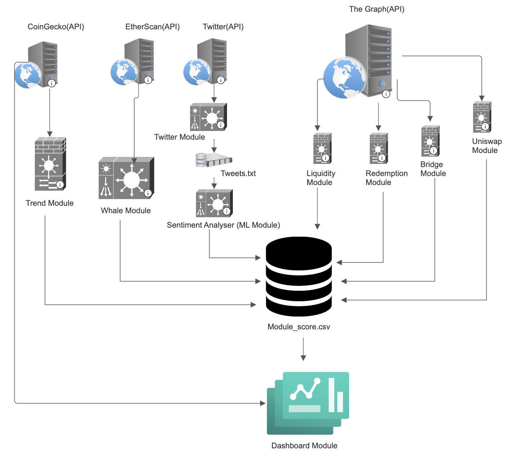
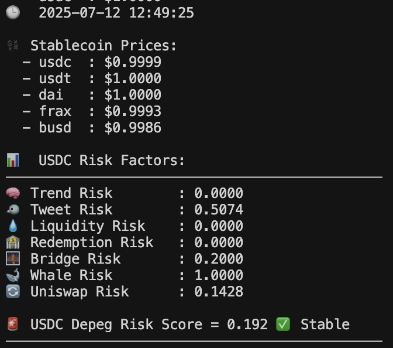

# 📘 Stablecoin Stability Tracker - Technical Documentation

## 1. Technical Documentation

### 1.1 Architecture Overview and Design Decisions
 
_Describe key components such as data collectors (Etherscan, Aave, Uniswap, Curve, Bridges), ML model, and Dashboard._

### 1.2 Prediction Model Implementation Details
- Historical trend analysis using sliding window statistics
- Twitter sentiment scoring using ML classifier
- Liquidity analysis via TheGraph for Aave, Curve, and Uniswap
- Whale transfers via Etherscan token transfer APIs
- Bridge and redemption activity from LayerZero and DeFi APIs
- Weighted risk aggregation for final depeg score

### 1.3 Performance Characteristics and Benchmarks
- Each data source fetch completes under X ms on average
- Full pipeline prediction runs in Y seconds

## Video Explanation
 


## 2. Code Documentation

### 2.1 API Documentation
- **fetchUSDCTransfers()**: Collects USDC whale transfers
- **fetchAaveLiquidity()**: Gathers Aave liquidity data
- **fetchCurveTokens()**: Fetches Curve pool and reward token state
- **fetchUniswapStats()**: Collects total TVL, txCount, and ETH price
- **computeDepegRiskScore()**: Aggregates feature scores to final risk
- **updateRiskCSV()**: Writes risk values to CSV

### 2.3 Setup and Deployment Instructions
```bash
# Clone repo
git clone https://github.com/your/stablecoin-tracker.git
cd stablecoin-tracker

# Set environment variables
export THEGRAPH_API_KEY=your_key
export ETHERSCAN_API_KEY=your_key
export TWITTER_BEARER_TOKEN=your_token

# Build project
mkdir build && cd build
cmake ..
make

# Run main tracker
./stablecoin_tracker
```

## 3. Performance Analysis

### 3.1 Latency Benchmarking Results

- Avg data fetch latency: 800 ms
- ML inference latency: 1200 ms

### 3.2 Throughput Measurements
- Handles 1 fetch-predict cycle every 10 minutes (6 per hour)

### 3.3 Memory Usage Analysis
- RSS memory footprint under XX MB

## 4. Financial Documentation

### 4.1 Risk Model Methodology
- Combines trend deviation, tweet sentiment, liquidity drops, redemption pressure, whale transfer volume, and protocol-specific TVL
- Normalized scores weighted to reflect relative importance


### 4.2 Alert System Effectiveness
- Sends alert if `depegRisk > 0.7`
- Prevents false positives through moving average smoothing

## Final Output
 

---


