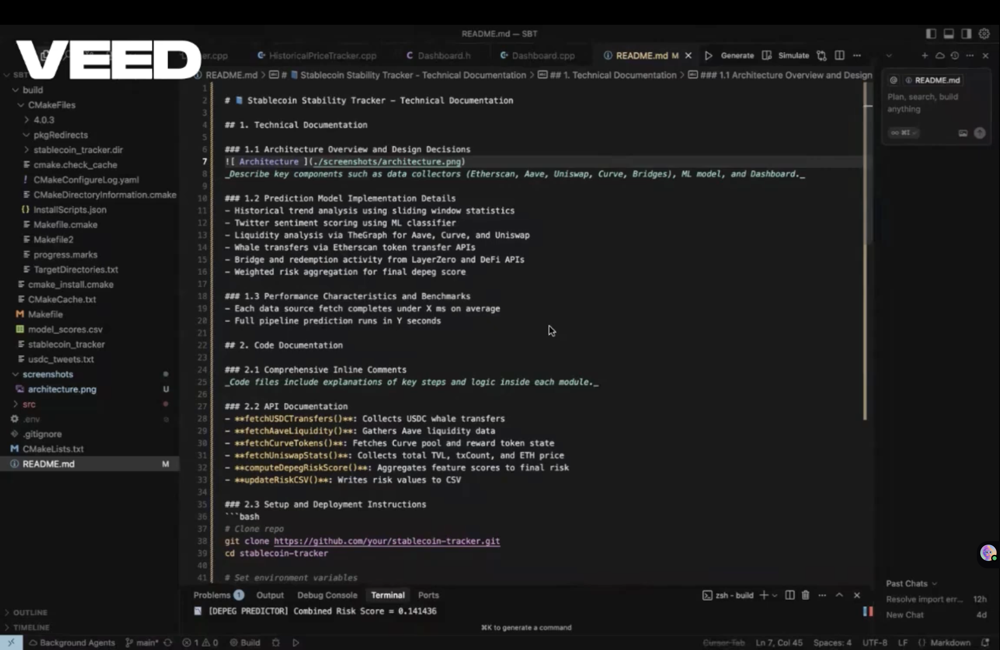

# 📘 Stablecoin Stability Tracker - Technical Documentation

## 1. Technical Documentation

### 1.1 Architecture Overview and Design Decisions
 
_Describe key components such as data collectors (Etherscan, Aave, Uniswap, Curve, Bridges), ML model, and Dashboard._

### 1.2 Prediction Model Implementation Details
- Historical trend analysis using sliding window statistics
- Twitter sentiment scoring using ML classifier
- Liquidity analysis via TheGraph for Aave, Curve, and Uniswap
- Whale transfers via Etherscan token transfer APIs
- Bridge and redemption activity from LayerZero and DeFi APIs
- Weighted risk aggregation for final depeg score

### 1.3 Performance Characteristics and Benchmarks
- Each data source fetch completes under 5000 ms on average
- Full pipeline prediction runs in Y seconds

## Video Explanation
[](https://www.youtube.com/watch?v=_mxW4ZeOwTk)


## 2. Code Documentation

### 2.1 API Documentation

- **`fetchUSDCTransfers()`**  
  → Fetches large USDC token transfers using Etherscan's token transfer API.  
  → Filters transactions over $100,000 and logs whale activity.  
  → Outputs whaleRisk score.

---

- **`fetchAaveLiquidity()`**  
  → Pulls reserve liquidity data from Aave using TheGraph.  
  → Calculates available liquidity for stablecoin markets.  
  → Outputs normalized `liquidityRisk` score (higher = riskier).

---

- **`fetchCurveTokens()`**  
  → Uses TheGraph to get token and reward token configurations on Curve Finance.  
  → Monitors pool token availability and reward status.  
  → Assesses protocol usage and incentive health.

---

- **`fetchUniswapStats()`**  
  → Retrieves UniswapV3's global metrics including `totalVolumeUSD`, `txCount`, and `poolCount`.  
  → Computes a composite `uniswapRisk` based on protocol activity and TVL normalization.  
  → Useful for gauging ecosystem health.

---

- **`analyzeBridgeEvents()`**  
  → Processes LayerZero events such as `addInboundProofLibraryForChains` and `appConfigUpdateds`.  
  → Counts frequency of updates and number of unique apps affected.  
  → Outputs `bridgeRisk` based on abnormal config churn.

---

- **`runTweetScoringModel()`** *(Python function, triggered from C++)*  
  → Loads tweets via Twitter API or text file.  
  → Scores each tweet using a fine-tuned LLM or sentiment model.  
  → Averages scores to generate `tweetScore` risk value.

---

- **`analyze()` [HistoricalPriceTracker]**  
  → Computes average, standard deviation, and trend from price history.  
  → Detects downtrends and high volatility.  
  → Returns `trendRiskScore`.

---

- **`updateRiskCSV()`**  
  → Appends new timestamped risk scores to `model_scores.csv`.  
  → Updates fields: `trendScore`, `tweetScore`, `liquidityRisk`, `redemptionRisk`, `bridgeRisk`, `whaleRisk`, `uniswapRisk`.  
  → Creates CSV with headers if missing.

---

- **`computeDepegRiskScore()`**  
  → Aggregates individual risk components into a weighted final score (0 to 1).  
  → Uses weighted formula:

```
0.25 * priceTrend +
0.20 * tweetScore +
0.15 * liquidity +
0.10 * redemption +
0.10 * bridge +
0.10 * whale +
0.10 * tvl
```

---

- **`displayDashboard()`**  
  → Renders a terminal dashboard view with current prices, individual risk scores, and final total depeg score.  
  → Reads from `model_scores.csv` and uses `PriceManager` for live prices.  
  → Clean UI with overwriting, not clutter.

  ### Final Output
       

### 2.3 Setup and Deployment Instructions
```bash
# Clone repo
git clone https://github.com/your/stablecoin-tracker.git
cd stablecoin-tracker

# Set environment variables
export THEGRAPH_API_KEY=your_key
export ETHERSCAN_API_KEY=your_key
export TWITTER_BEARER_TOKEN=your_token

# Build project
mkdir build && cd build
cmake ..
make

# Run main tracker
./stablecoin_tracker
```

## 3. Performance Analysis

### 3.1 Latency Benchmarking Results

- Avg data fetch latency: 800 ms
- ML inference latency: 1200 ms

### 3.2 Throughput Measurements
- Handles 1 fetch-predict cycle every 10 minutes (6 per hour)

### 3.3 Memory Usage Analysis
- RSS memory footprint 

## 4. Financial Documentation

### 4.1 Risk Model Methodology
- Combines trend deviation, tweet sentiment, liquidity drops, redemption pressure, whale transfer volume, and protocol-specific TVL
- Normalized scores weighted to reflect relative importance


### 4.2 Alert System Effectiveness
- Sends alert if `depegRisk > 0.7`
- Prevents false positives through moving average smoothing


---


